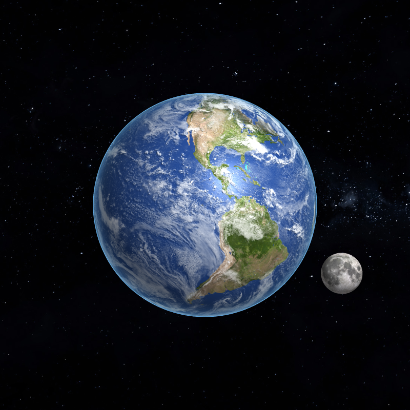

# Ray Tracing Tutorial
For those who want to learn about ray tracing from scratch and would love to get a taste of computer graphics. Learn with me!

This tutorial is written by a student who had no former knowledge of computer graphics. Please feel free to make corrections, give feedback, or add resources!

## Prerequisites
- Basic HTML
- Javascript (ES6)
    - [import/export](https://javascript.info/import-export)
    - [class](https://www.w3schools.com/js/js_classes.asp)
- High school math

## Table of Contents
### Basics
- [What is ray tracing?](docs/00_what_is_ray_tracing.md)
- [Working with HTML canvas](docs/01_working_with_html_canvas.md)
- [Generating rays](docs/02_generating_rays.md)
- [Ray-sphere intersection](docs/03_ray-sphere_intersection.md)
- [Shading](docs/04_shading.md)
    - [Diffuse (Lambertian)](docs/04_shading.md#diffuse-lambertian)
    - [Ambient](docs/04_shading.md#ambient)
    - [Specular (Phong)](docs/04_shading.md#specular-phong)
    - [Shadows](docs/04_shading.md#shadows)
- [Anti-aliasing](docs/05_anti-aliasing.md)

### Textures
- Transformations
    - Translation
    - Rotation
    - Scaling
- Texture mapping
    - UV mapping
    - Normal mapping

### Reflection & Refraction
- Reflection
- Refraction
- Fresnel effect
- Beer’s law

### More
- [Further topics](docs/further_topics.md)
- [Useful resources](docs/useful_resources.md)
