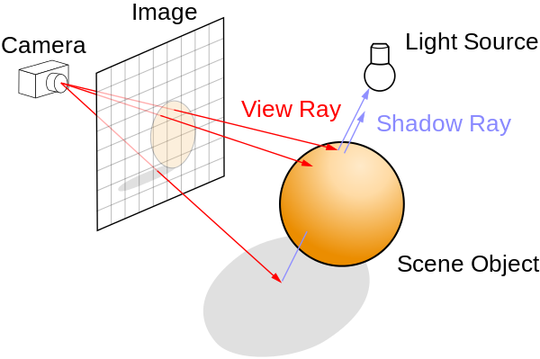

# What is ray tracing?
Ray tracing is a rendering technique in computer graphics—given 3-dimensional data, such as that of a sphere which we will later see in this tutorial, represent it on a 2-dimensional image such that we can see on our computer screen.

Recall that what we actually “see” is light reflected off a surface of an object. Hence, ray tracing generates realistic images by simulating light, which can be applied to animation and game productions.

However, tracing a path of light from a light source to a surface then to a viewer will be inefficient since not all light rays will reach the viewer. Hence, we can trace in the opposite direction—from the eye to the surface then to the light source.

More specifically, we create a world as a 3-dimensional vector space where objects are actually placed, then we shoot a ray through each pixel of the image, check if the ray intersects with any object, and compute the color of that pixel.

In this tutorial, you will get to understand ray tracing by building a ray tracer from the ground up without using an external library (eg. [three.js](https://threejs.org)) or a tool (eg. Maya), except for the one for vector and matrix calculation to avoid unnecessary complications and optionally jQuery.

**Resources**
- https://www.scratchapixel.com/lessons/3d-basic-rendering/ray-tracing-overview/ray-tracing-rendering-technique-overview
- https://www.scratchapixel.com/lessons/3d-basic-rendering/introduction-to-ray-tracing/implementing-the-raytracing-algorithm
