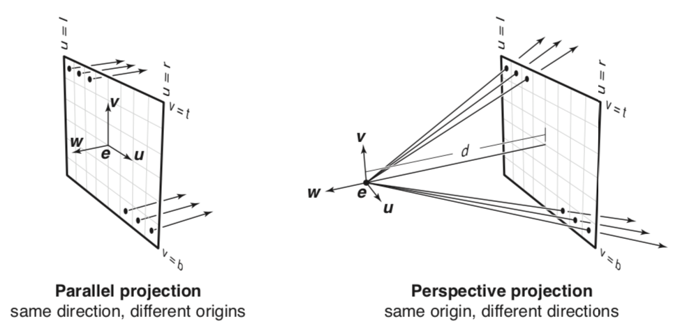

# Generating rays
## Ray class
So, what is a ray and how do we generate it? As I have said, 3d objects are defined in a vector space, thus a ray can be defined as a starting point (origin) with a direction vector in the form of a line `p(t) = e + td` where `p` is a point on the ray, `e` is the origin, `d` is the direction, and `t` is a real number that determines the position of the point. Hence, we can create a JavaScript file `Ray.js` and define the Ray class as below where `origin` and `direction` are `vec3` objects from [glMatrix library](http://glmatrix.net).

```javascript
class Ray {
  constructor(origin, direction) {
    this.origin = origin;
    this.direction = direction;
  }
}
```

## Parallel vs. perspective projection



One way to project the ray is a parallel projection where all rays start at the pixel’s location and share the same direction. On the other hand, for a perspective projection, all rays start at one origin (often called the “eye” or “camera”) and each ray’s direction points toward the pixel’s location. For our ray tracer, we will implement the perspective projection.

## Computing ray direction
To compute the direction of each ray, we need to know `(u, v)` coordinates of a point on the image plane that correspond to `(i, j)` coordinates of a pixel.

Let’s first define the position of the image plane; let `l` and `r` be the positions of the left and right edges of the image plane measured along the x-axis and `b` and `t` be the positions of the bottom and top edges of the image plane measured along the y-axis. These are all measured from the ray origin by treating it as `(0, 0, 0)`. Watch out that in the coordinate system we use, the value of x increases as you go right, the value of y increases as you go up, and the value of z *decreases* as you go towards the plane. Be sure to match the ratio of the width and height of the image plane with that of the canvas. Otherwise, the rendered image will look stretched.

If the image has `nx` x `ny` pixels, to fit it into the image plane of size `(r - l)` x `(t - b)`, the pixels are spaced `(r - l) / nx` horizontally and `(t - b) / ny` vertically. Since `(i, j)` coordinates indicate the bottom-left corner of the pixel grid, adding 0.5 to center the positions, we get the following equations for `u` and `v`.
- `u = l + (r - l) * (i + 0.5) / nx`
- `v = b + (t - b) * (j + 0.5) / ny`


Note that we are using the pixel coordinate system where `(0, 0)` is located at the bottom-left corner of the image (right).

Additionally, to compute the direction, we need to know `d`, a distance the image plane is positioned from the ray origin, also called focal length.

Hence, we can create a JavaScript file `main.js` and add the following code to generate a ray through each pixel.

```javascript
for (let i = 0; i < nx; i++) {
  for (let j = 0; j < ny; j++) {
    const u = l + (r - l) * (i + 0.5) / nx;
    const v = b + (t - b) * (j + 0.5) / ny;
    const rayOrigin = vec3.fromValues(0, 0, 15);
    let rayDirection = vec3.fromValues(u, v, -d);
    vec3.normalize(rayDirection, rayDirection);
    const ray = new Ray(rayOrigin, rayDirection);
  }
}
```

Note that you are free to set the ray origin as whatever you want.

To learn more about positioning or orienting the camera, you might want to read more about camera frame (defining `u, v, w` vectors) and different spaces (coordinate systems) involved in ray tracing.

**Resources**
- Fundamentals of Computer Graphics - Chp. 4.2, 4.3
- https://www.scratchapixel.com/lessons/3d-basic-rendering/ray-tracing-generating-camera-rays
- https://www.scratchapixel.com/lessons/3d-basic-rendering/ray-tracing-generating-camera-rays/generating-camera-rays
- https://www.cs.cornell.edu/courses/cs4620/2013fa/lectures/02view-ray.pdf
- http://www.codinglabs.net/article_world_view_projection_matrix.aspx
