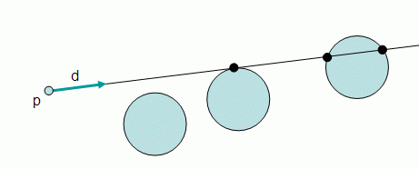
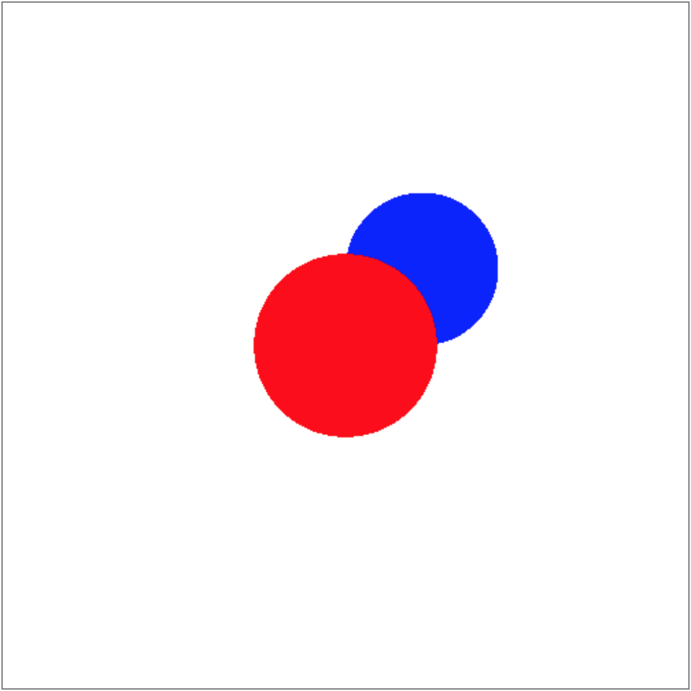

# Ray-sphere intersection
Now we have generated a ray, we need to check if it intersects with any object in the world so that we can determine the color of the pixel the ray is shot through. Let’s start with a sphere.

## Sphere class
To define a sphere, we need `(x, y, z)` coordinates of its center, radius, and `r, g, b` values of its surface color. Hence, we can create a JavaScript file `Sphere.js` and define the Sphere class as below.

```javascript
class Sphere {
  constructor(x, y, z, radius, r, g, b) {
    this.center = vec3.fromValues(x, y, z);
    this.radius = radius;
    this.color = [r, g, b];
  }
}
```

## Finding the intersection
We already know the vector equation of a sphere: `(p - c) • (p - c) - R^2 = 0` where `p` is a point, `c` is the sphere’s center, and `R` is its radius. This tells us that any point `p` that satisfies this equation is on the sphere. Hence, to check if the ray intersects with the sphere, we can plug the points on the ray `p(t) = e + td` into this equation. Then, we get `(e + td - c) • (e + td - c) - R^2 = 0`. Rearranging the terms, `(d • d)t^2 + 2d • (e - c)t + (e - c) • (e - c) - R^2 = 0`, which is a quadratic equation in the form of `At^2 + Bt + C = 0`! Hence, we can first find the discriminant `B^2 - 4AC` to check if a real solution exists, then solve for `t` using the quadratic formula: `t = (-d • (e - c) +/-sqrt((d • (e - c))^2 - (d • d)((e - c) • (e - c) - R^2))) / (d • d)`.



Note that when the discriminant is a non-zero positive number, the ray will intersect with the sphere at two points, resulting in two `t` values. In this case, we would like to choose the point that is closer to the ray origin, thus smaller value of `t` because that is what will be visible to us. Hence, we can add the `intersects` method to the Sphere class that returns `t` value of the intersection, `null` if there’s no intersection. This allows us to check if the ray intersects with the sphere (`t` is not `null`) and if it does, find the point of intersection by plugging `t` into the ray equation.

```javascript
intersects(ray) {
  const oc = vec3.subtract(vec3.create(), ray.origin, this.center);
  const a = vec3.dot(ray.direction, ray.direction);
  const b = 2 * vec3.dot(ray.direction, oc);
  const c = vec3.dot(oc, oc) - this.radius * this.radius;
  const discriminant = b * b - 4 * a * c;
  if (discriminant < 0) {
    return null;
  }
  const t = (-b - Math.sqrt(discriminant)) / (2 * a);
  return t;
}
```

## Rendering spheres
Now we have generated a ray and know how to check its intersection with a sphere, we can traverse over all the spheres in the world and see if any of them intersects with the ray. Of all the spheres the ray has intersected with, we want to render the closest one. Also, we can’t see an object if it’s behind the eye, hence we want to render a sphere only if its `t` value is positive. Hence, we can add the following code to `main.js` to find the closest intersecting sphere where `objects` is an array of Sphere objects.

```javascript
let tMin = Infinity;
let closest = null;
for (let k = 0; k < objects.length; k++) {
  const t = objects[k].intersects(ray);
  if (t != null && t > 0 && t < tMin) {
    closest = objects[k];
    tMin = t;
  }
}
```

For now, we can set the color of the pixel as the intersected sphere’s color or white if there’s no intersection.



[Source code](https://github.com/sangwo/web-ray-tracer-examples/tree/ray-sphere).

**Resources**
- Fundamentals of Computer Graphics - Chp. 4.4.1
- https://raytracing.github.io/books/RayTracingInOneWeekend.html#addingasphere
