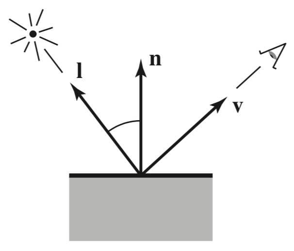
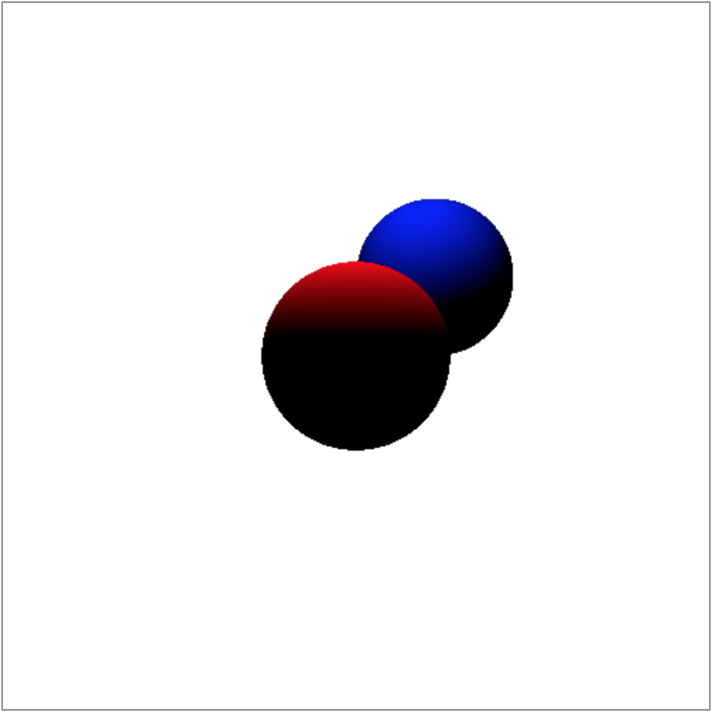
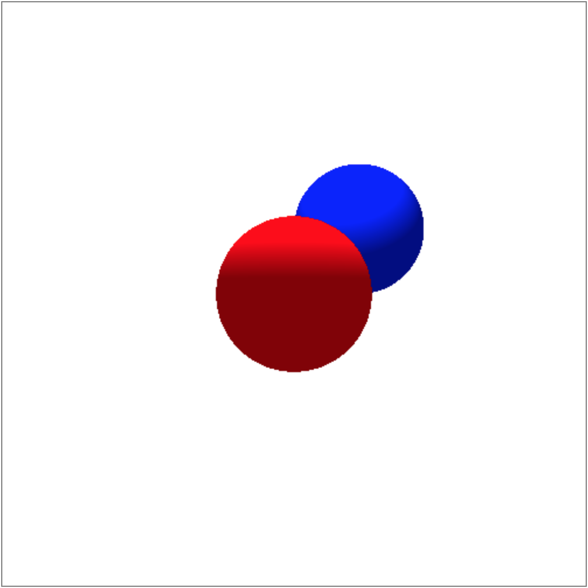
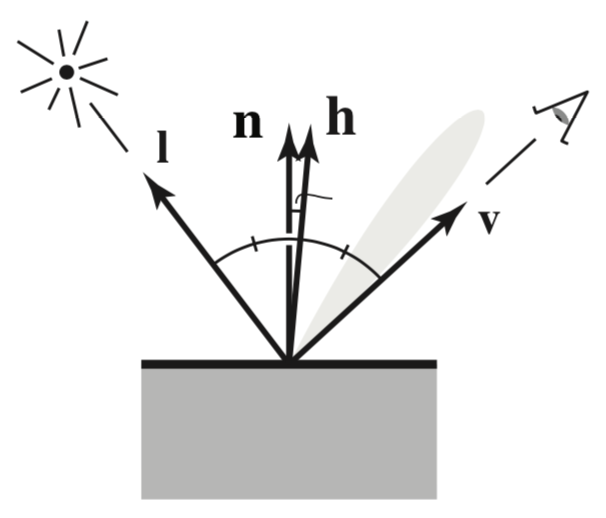
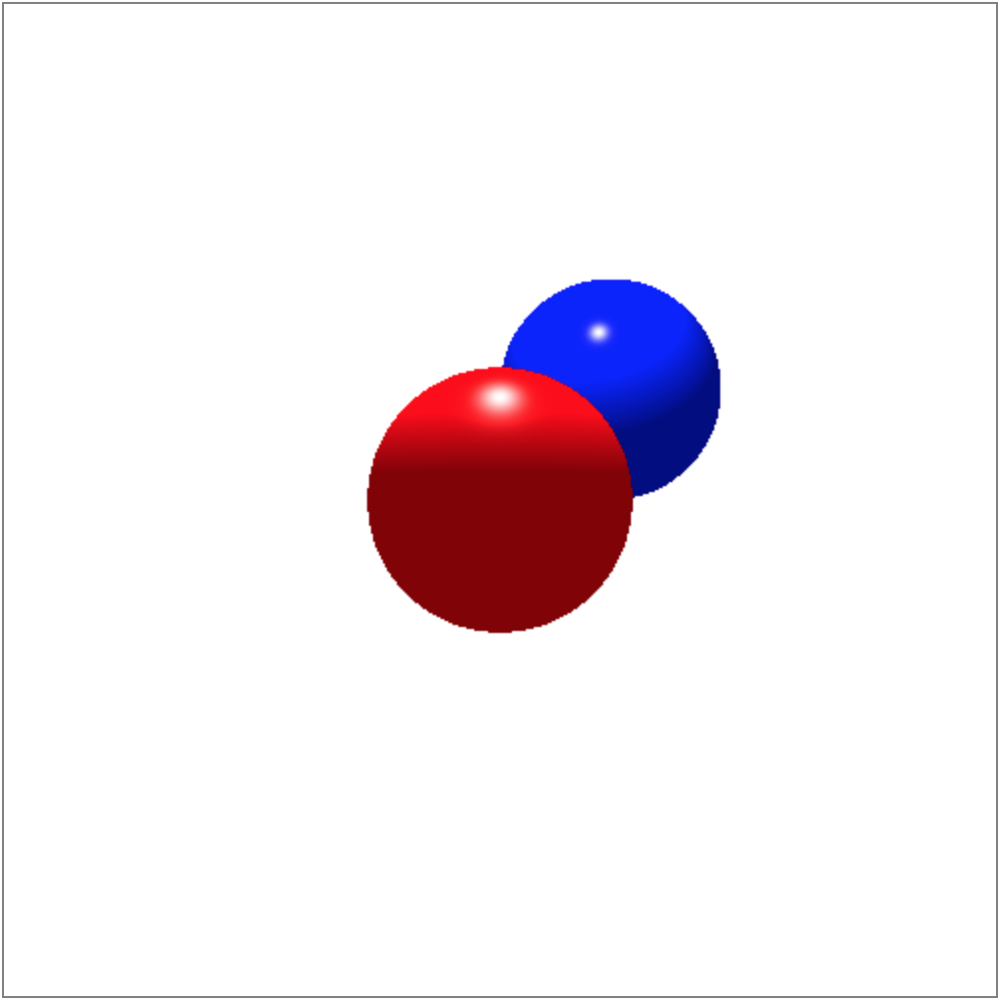
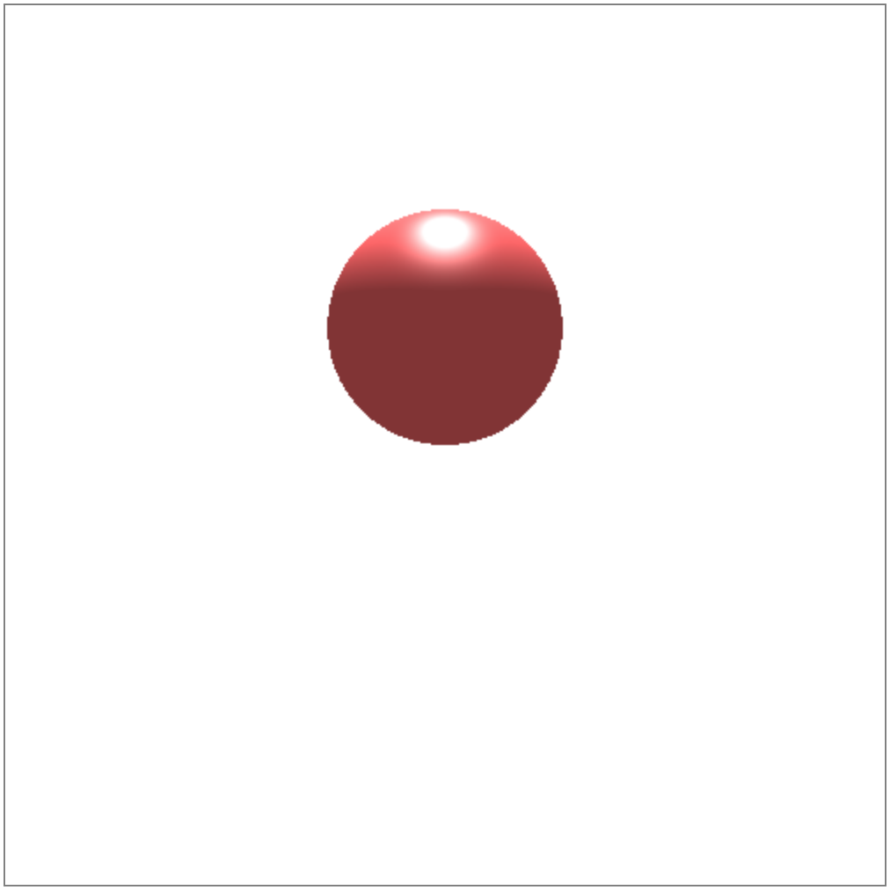
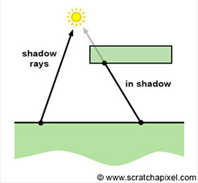
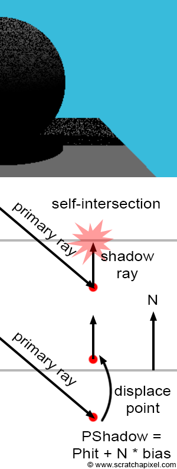

# Shading
So we have successfully rendered spheres, but the resulting image seems flat. This is because in reality, objects interact with **light**, thus different parts of the object’s surface are illuminated differently, resulting in varying colors. Hence, let’s define the Light class in a JavaScript file `Light.js` and make our world brighter!

```javascript
class Light {
  constructor(x, y, z, r, g, b) {
    this.position = vec3.fromValues(x, y, z);
    this.color = [r, g, b];
  }
}
```

Based on how the color is computed at a point, various shading models are used. This tutorial will introduce the Blinn-Phong model which consists of three components—diffuse (Lambertian), ambient, and specular (Phong).

## Diffuse (Lambertian)



The amount of illumination at a point depends on the angle of a surface to the light; a surface facing the light directly is illuminated the most while a surface tangent to or facing away from the light is not illuminated at all. Hence, the following equation calculates the pixel color `L` at the point whose normal `n` and light direction `l` form an angle `theta`:
`L = k_d * I * max(0, cos(theta))`
where `k_d` is the diffuse coefficient (surface color) of the surface and `I` is the intensity of the light, which is just an array of `r, g, b` values. If `n` and `l` are normalized, then we know `n • l = cos(theta)`. Hence, the above equation can be rewritten as
`L = k_d * I * max(0, n • l)`.

Note that `L` needs to be calculated for each color channel `r, g, b`.

Hence, we can add the `computeDiffuse` method to `main.js` that computes and returns the diffuse component as an array of color values `r, g, b` in the range between 0 and 1.

```javascript
function computeDiffuse(color, normal, lightDirection) {
  let diffuse = [];
  for (let c = 0; c < 3; c++) {
    diffuse[c] = (color[c] / 255) * (light.color[c] / 255) *
        Math.max(0, vec3.dot(normal, lightDirection));
  }
  return diffuse;
}
```

To calculate the normal, we can also add the `normal` method to `Sphere.js` that accepts a point and returns a normal at the point which is just a vector from the sphere’s center to the point.

```javascript
normal(point) {
  let normal = vec3.subtract(vec3.create(), point, this.center);
  vec3.normalize(normal, normal);
  return normal;
}
```

Finally, we can add the `pointAtParameter` method to `Ray.js` that accepts `t` value and returns the point on the ray which we will need for calculating the normal and the light direction.

```javascript
pointAtParameter(t) {
  return vec3.add(vec3.create(), this.origin, vec3.scale(vec3.create(),
      this.direction, t));
}
```

With the diffuse component, we get a more 3d-like image.



## Ambient
From the image above, notice that the parts that the light doesn’t directly hit are rendered as complete black. However, this is often not what happens in the real world due to indirect illumination (reflections from other surfaces). Hence, we want to add a constant color by assuming that an ambient light comes equally from every direction. With the ambient component, we can rewrite the equation as
`L = k_a * I_a + k_d * I * max(0, n • l)`
where `k_a` is the ambient coefficient (ambient color) of the surface that is usually set to the surface color and `I_a` is the intensity of the ambient light.

Hence, we can add the `computeAmbient` method to `main.js` that computes and returns the ambient component as an array of color values `r, g, b` in the range between 0 and 1.

```javascript
function computeAmbient(ambientColor) {
  let ambient = [];
  for (let c = 0; c < 3; c++) {
    ambient[c] = (ambientColor[c] / 255) * (ambientLightIntensity[c] / 255);
  }
  return ambient;
}
```

Note that light is **additive** which is why we can just add two components to obtain the pixel color. We want to keep the color values in the range between 0 and 1, but the sum of the two components might exceed 1, in which case we need to “clamp”—values greater than 1 will be reduced to 1. Hence, after adding the diffuse and ambient, be sure to “clamp” as below.

```javascript
Math.min(1, Math.max(0, value))
```

With the ambient component added, we get the following image.



## Specular (Phong)



The spheres in the resulting image look chalky, or matte. However, in the real world, many objects are shiny to some extent, producing highlights, or specular reflections. These highlights move along the surface of an object as the view direction changes. More accurately, they are just reflections of a light source, thus appear when mirror reflection occurs, that is, when the view direction `v` and the light direction `l` are symmetrically positioned about the surface normal `n`. We can estimate how close it is to the mirror reflection by comparing the half vector `h`, which bisects the angle between `v` and `l`, and the normal. For instance, if they are near, the specular reflection will be bright while dim if they are away. Hence, just as we did to calculate the diffuse component, let’s take a dot product of `n` and `h` where `h = (v + l) / ||v + l||`. Again, make sure `n` and `h` are normalized.

Depending on how shiny you want the object to be, you can take the result to a power `p > 1`, or Phong exponent, to make the surface look shinier. Hence, with the specular component added, we can rewrite the equation as
`L = k_a * I_a + k_d * I * max(0, n • l) + k_s * I * max(0, n • h)^p`
where `k_s` is the specular coefficient (specular color) of the surface that is usually set to gray (`r, g, b` values are equal).

Hence, we can add the `computeSpecular` method to `main.js` that computes and returns the specular component as an array of color values `r, g, b` in the range between 0 and 1.

```javascript
function computeSpecular(specularColor, normal, halfVector, shininess) {
  let specular = [];
  for (let c = 0; c < 3; c++) {
    specular[c] = (specularColor[c] / 255) * (light.color[c] / 255) *
        Math.pow(Math.max(0, vec3.dot(normal, halfVector)), shininess);
  }
  return specular;
}
```

With the specular component added, we get the following image.



One issue with the “add and clamp” method when the specular is added is that the specular reflection looks weird—too bright and big—when the color values are high and the shininess is low enough. For instance, consider a sphere with the surface color (255, 100, 100) and the shininess 20.



The result isn’t what we expected—we expected it to be more matte-looking, but it still seems very shiny. This is because the rougher the surface is, the fewer light rays would be reflected toward the viewer, hence the specular highlight would be dimmer. Recall that we’ve set (255, 255, 255) as the default specular color. Therefore, we can adjust the specular color `k_s` appropriately depending on the shininess to produce a better image.


See https://www.scratchapixel.com/lessons/3d-basic-rendering/phong-shader-BRDF for a more detailed explanation.

## Shadows



Additionally, we can add more realism by making objects cast shadows. We know that a point is in shadow if there is an opaque object in its path to the light. Hence, for every intersection point, we can cast a shadow ray from the point in the direction of the light and check if the ray intersects with any object just as we did with the primary ray. If there’s an intersection, then the point will receive no illumination hence only its ambient component is shown as ambient is independent of light. If there’s no intersection, then the point will be shaded normally. Hence, we can make shadow to be 0 if the point is in shadow, otherwise 1.

```javascript
const shadowRay = new Ray(point, lightDirection);
const lightDistance = vec3.distance(point, light.position);
const shadowIntersect = intersection(shadowRay, objects, lightDistance);
const shadow = shadowIntersect.obj == null;
```

Note that the `intersection` method returns the object the shadow ray intersects with and `t` value of the intersection. Also, we are using `lightDistance` instead of `Infinity` as `tMin` unlike with the primary ray because we are only checking for an intersection up to distance to the light.

Hence, the new equation that incorporates shadow is
`L = k_a * I_a + (k_d * I * max(0, n • l) + k_s * I * max(0, n • h)^p) * shadow`.

Again, note that ambient is not affected by shadow.



However, sometimes the resulting image would contain noises like above. This problem is known as **shadow-acne** which is caused by self-intersection. That is, since a computer’s memory is finite, small imprecisions are introduced when storing numerical values. This causes the intersection point to be located slightly below the surface, so when the shadow ray is cast from the point, it intersects with the same object it was cast from. So even when there are no other objects between the object and the light, the point becomes shadowed by itself!

A simple solution is to move the point up in the direction of the surface normal so that it is now above the surface. The amount of displacement is often referred to as shadow bias.

```javascript
const overPoint = vec3.add(vec3.create(), point, vec3.scale(vec3.create(),
    normal, shadowBias));
const shadowRay = new Ray(overPoint, lightDirection);
```

With shadow added, the following image is produced. To make it easier to see if shadow is casted correctly, `Triangle` objects were added.


[Source code](https://github.com/sangwo/web-ray-tracer-examples/tree/shading).

**Resources**
- Fundamentals of Computer Graphics - Chp. 4.5, 4.7
- https://www.scratchapixel.com/lessons/3d-basic-rendering/introduction-to-shading/ligth-and-shadows
