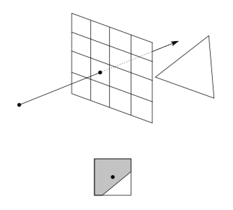
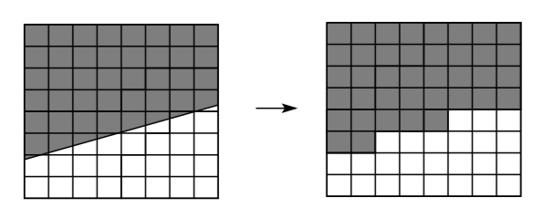
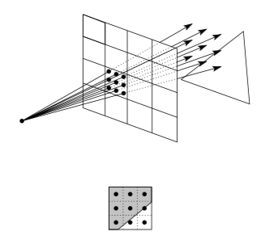
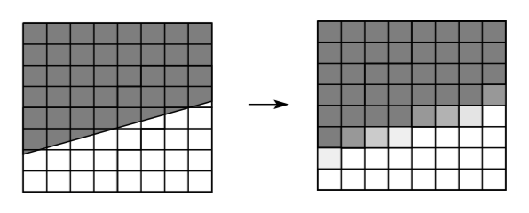
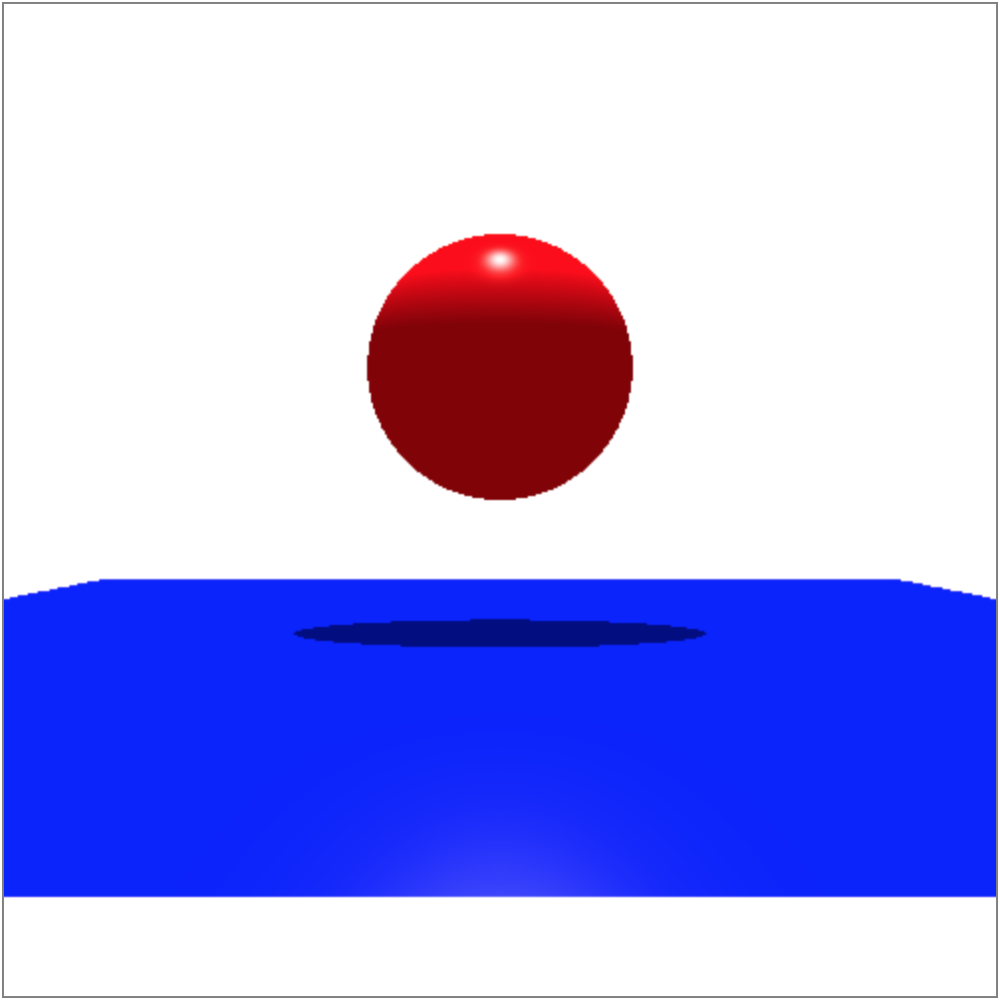
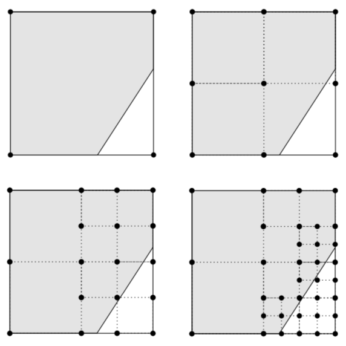

# Anti-aliasing
We’ve added objects to our world and shaded them, but the result still doesn’t look good. Notice the “stairs,” or jaggies at the edge of the sphere. These artifacts are called “alias.”




Remember that we’ve been casting one ray per pixel at its center. In other words, we’ve taken one sample per pixel. Looking at the image above, this causes a pixel to be colored regardless of whether all or half of the pixel includes the object, as long as it’s included in the pixel’s center. Hence, one way to improve is to cast multiple rays per pixel and average the colors to get the final color. This way of reducing alias, or anti-aliasing, is known as **supersampling**.




Hence, for each pixel, we will further divide it into sub-pixels and generate a ray for each sub-pixel. For instance, the following pseudocode implements 4x4 supersampling (16 samples per pixel).

```javascript
// for each pixel
for (let i = 0; i < nx; i++) {
  for (let j = 0; j < ny; j++) {
    let color = [0, 0, 0]; // r, g, b
    // for each sub-pixel
    for (let ic = i; ic < i + 1; ic += 1 / 4) {     // *
      for (let jc = j; jc < j + 1; jc += 1 / 4) {   // *
        // generate a ray
        const u = l + (r - l) * (ic + 1 / 8) / nx;  // *
        const v = b + (t - b) * (jc + 1 / 8) / ny;  // *
        ...
        const ray = new Ray(rayOrigin, rayDirection);

        // find and accumulate color of the sub-pixel  *
      }
    }
    // average                                         *
    // color the pixel
}
```

Compare the resulting image with the one in the shading section to see how clearer it became.




[Source code](https://github.com/sangwo/web-ray-tracer-examples/tree/anti-aliasing).

Notice how costly this is. For a 500x500 image, we will be casting 500 * 500 * 4 * 4 = 4 million rays! And some of them are actually unnecessary as the colors of adjacent rays are often similar or even the same. Hence, we can reduce the number of unnecessary samples by supersampling only when there are rapid changes in the pixel’s intensity. This method is known as **adaptive sampling**. I won’t delve into the specifics here, but you can read more about it in the resources below.



Finally, we can further remove the alias caused by a regular grid (all rays are sent to the center of each sub-pixel) by distributing, or jittering rays. In other words, we can position samples randomly within each sub-pixel. This method is known as **distributed ray tracing**. In the code above, we’ve added `1 / 8` to `ic` and `jc` to sample the center of a sub-pixel. To sample a random position within a sub-pixel, we can edit the code as below.

```javascript
const u = l + (r - l) * (ic + (Math.random() / samplingWidth)) / nx;
const v = b + (t - b) * (jc + (Math.random() / samplingHeight)) / ny;
```

Other than anti-aliasing, distributed ray tracing is used to create motion blur, depth of field (when applied to eye/camera rays), soft shadows (when applied to shadow rays), glossy surfaces (when applied to reflection rays), and diffuse glass (when applied to refraction rays). You can read more about it in the resources below.

**Resources**
- https://courses.cs.washington.edu/courses/csep557/01sp/lectures/aa-and-drt.pdf
- An Introduction to Ray Tracing - Chp. 4.5 (Adaptive Supersampling)
- https://cglab.gist.ac.kr/courses/2017_spring_CG/2017_05_24_Distributed_Ray_Tracing.pdf
- http://graphics.pixar.com/library/DistributedRayTracing/paper.pdf
